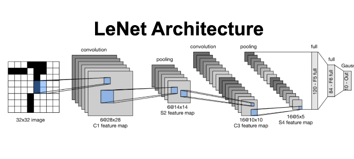

# Scenes - a Deep Machine Learning Model
## Overview
This repository contains a model built using a convolutional neural network (specifically a LeNet-5 architecture) that detects scenes within images. Through this project, I gained familiarity with the PyTorch ML library, computer vision, and deep learning through a convolutional neural network architecture.

 

## Dataset
The dataset utilized is MiniPlaces, a scene recognition dataset developed by MIT. More information on the dataset can be found [here](https://github.com/CSAILVision/miniplaces).

## Results
I trained the model under different configurations in order to find what optimal settings produced the most accurate results with least amount of work, in hopes of avoiding under/overfitting. The changed variables were batch size, learning rate, and number of epochs influenced. I found the most optimal training method was utilizing a batch size of 8, a default learning rate of 0.01.

## Author
Project developed for **CS 540: Intro to AI** by **Matthew Thompson Soto**. April 2022. 
